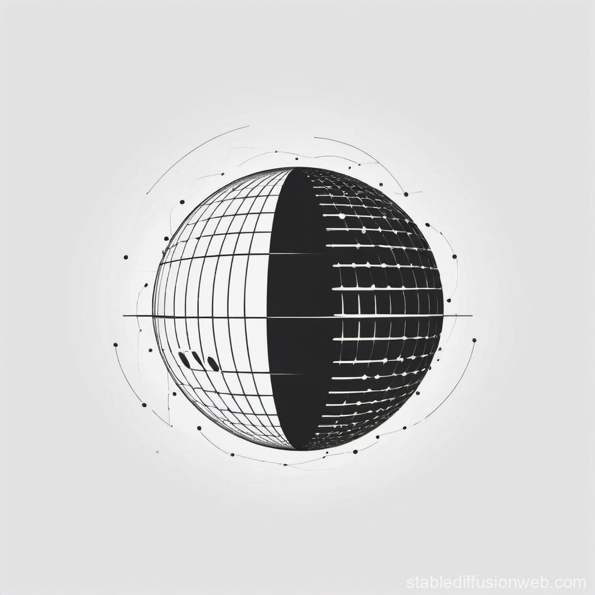

    
    <h2 align="center">Illumin8</h2>
    
A simple ray tracer built from scratch to render realistic 3D scenes with reflections, shadows, and light interactions. Designed for learning and exploring the fundamentals of graphics rendering.

### Installation

### Features

### Gallery

### License

Have a look at the [license file](./LICENSE) for details.